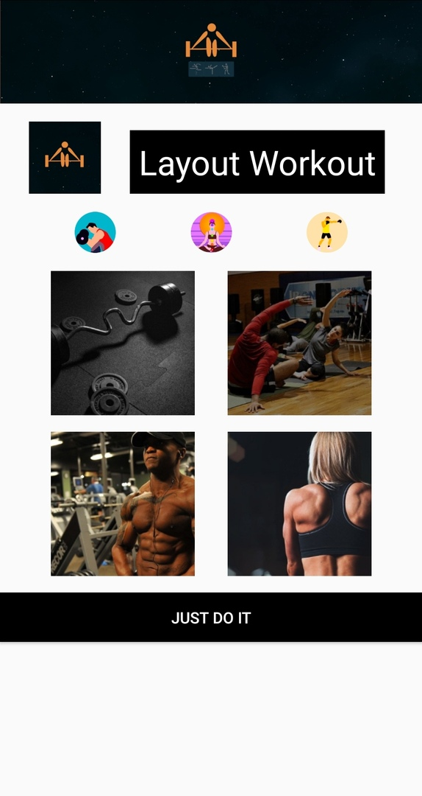
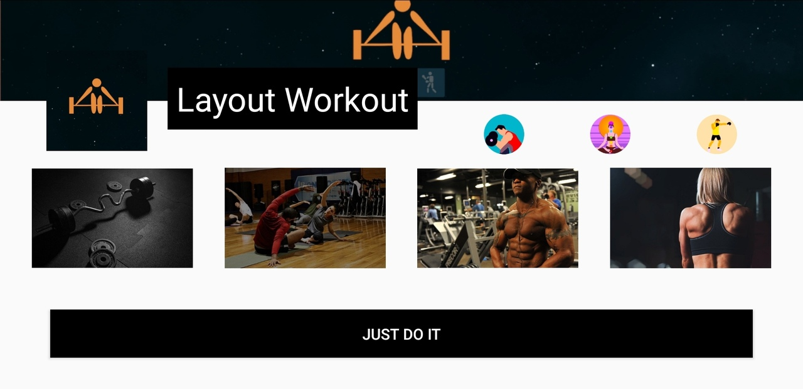

# android_layout_training
Layout training, it is not a final work

# What can it  do?
  - It is just good UI and Data Binding test :3

# What I learnt?
  - Data Binding Library basics
  - Constraint Layout basics
  - Elements align, chains creating
  - Custom layout for diffrent screen modes and sizes
  - Adaptive layout for diffrent screen modes and sizes
  - Guidelines and Barriers

# Portrait mode

# Landscape mode

**hello world:)**
